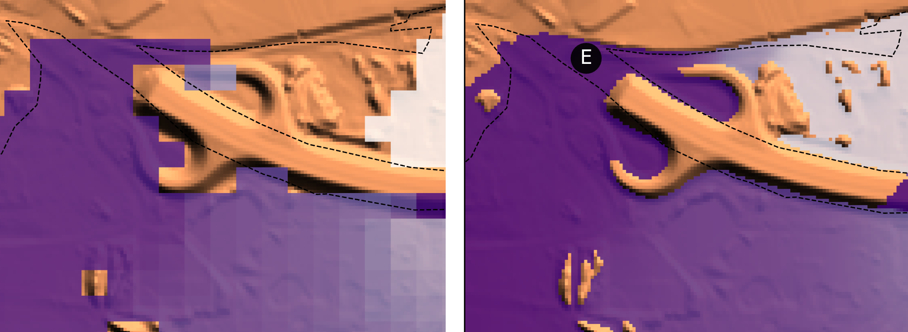
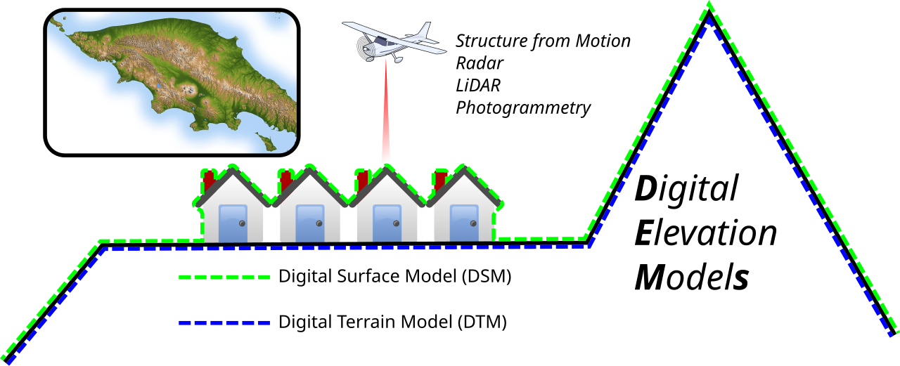
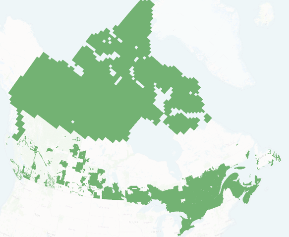

User Guide
==========

Introduction
------------

``floodsr`` is a flood-depth **resolution enhancement** tool.
Or a super-resolution (SR) tool in machine-speak.
It takes a low-resolution depth raster as input and reconstructs higher-resolution output, using terrain (DEM) context.

Basically, moving from the blocky grid on the left to the smooth grid on the right:

Digital Elevation Models (DEMs)
-------------------------------
Unlike some other super-resolution tools, ``floodsr`` leverages terrain information to provide more physically based flood reconstructions.
This information is supplied as a high-resolution DEM.
``floodsr tohr`` will propagate water water across whatever DEM grid is provided, so a user must take care to ensure the DEM reflects the intended propagation surface.
For example, removing buildings or burning flowpaths through roads.

Image: Arbec, CC BY 4.0, via Wikimedia Commons.

The hi-res DEM input can be specified with the ``--dem`` flag.

HRDEM Mosaic
~~~~~~~~~~~~
Natural Resources Canada develops and hosts the `High Resolution Digital Elevation Model Mosaic <https://open.canada.ca/data/en/dataset/0fe65119-e96e-4a57-8bfe-9d9245fba06b>`_, which provides a unique and continuous representation of the high resolution elevation data available across Canada.
In Southern Canada, this is built mainly from fixed wing LiDAR, providing an awesome resource for fetchable terrain data via their Web Coverage Services (WCS).
Coverage circa 2026 is shown below:

To automate the use of HRDEM data for resolution enhancement of flood grids in Canada, ``floodsr tohr`` can directly fetch HRDEM tiles with the ``--fetch-hrdem`` flag.

Models
------
To support a wide range of use-cases and adaptability, ``floodsr`` facilitates resolution enhancement via various *models*.
To see the supported models, use the ``floodsr models list`` command.

ResUNet_16x_DEM
~~~~~~~~~~~~~~~

This is the original machine-learning based model implemented in `floodsr`.
It uses a DEM-aware ResUNet that fuses low-resolution depth with high-resolution terrain context, reconstructs features on the low-resolution grid, and upsamples them by 16x to predict high-resolution depth.

Training
~~~~~~~~

- Used Rim2D to simulate a large set of inundation tiles for training and HRDEM.
- Depth and DEM inputs were normalized for stable learning.
- Optimization used Adam with gradient clipping and a scheduled learning rate.

Inference
~~~~~~~~~

- Inference validates the inputs and applies model-specific preprocessing.
- The model runs tile by tile, then blends overlapping predictions into a continuous surface.
- The final output is converted back to depth units on the target grid.

CostGrow
~~~~~~~~~~~~~~~

rules-based. not implemented yet. 

